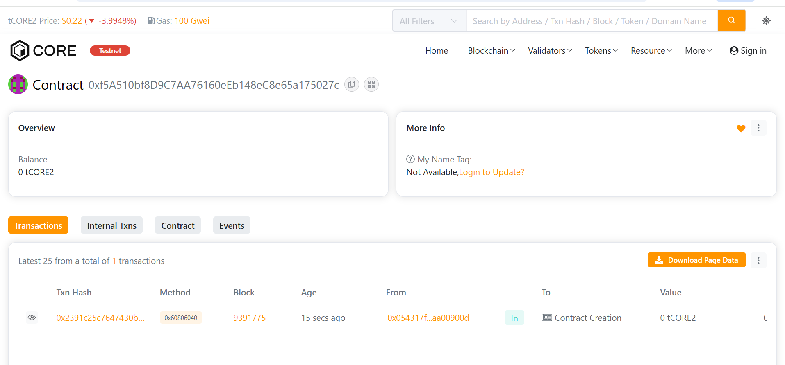

### 7. README.md
```markdown
# ProofMesh


[](https://soliditylang.org/)
[](https://hardhat.org/)
[](https://opensource.org/licenses/MIT)

## Project Description

**ProofMesh** is a revolutionary decentralized proof-of-authenticity and verification network built on blockchain technology. It creates an interconnected mesh of cryptographic proofs for documents, assets, identities, claims, and certificates. By leveraging blockchain's immutability and decentralization, ProofMesh establishes a trustless verification system where multiple authorized verifiers can attest to the authenticity of any digital or physical asset.

The platform enables users to:
- **Create Immutable Proofs**: Generate cryptographic proofs for any document, asset, or claim
- **Decentralized Verification**: Multiple independent verifiers validate authenticity
- **Build Proof Networks**: Link related proofs together to create verification meshes
- **Track Provenance**: Maintain complete audit trails of verification history
- **Manage Reputation**: Verifiers earn reputation through consistent, accurate validations
- **Set Expiry Times**: Time-bound proofs for temporary certifications

ProofMesh solves the critical problem of trust in digital verification by removing centralized authorities and creating a transparent, auditable, and tamper-proof verification infrastructure.

## Project Vision

Our vision is to become the **global standard for decentralized verification**, creating a world where authenticity and trust are built on cryptographic proof rather than institutional authority.

### Core Vision Pillars:

🌍 **Universal Trust Layer**
- Build a global verification infrastructure accessible to everyone
- Remove geographic and institutional barriers to trust
- Enable peer-to-peer verification without intermediaries

🔗 **Interconnected Proof Network**
- Create a mesh of linked proofs that strengthen each other
- Enable transitive trust through proof chains
- Build a web of verification that grows stronger over time

🏛️ **Democratized Authority**
- Distribute verification power across multiple independent validators
- Eliminate single points of failure in trust systems
- Enable reputation-based meritocracy for verifiers

🔐 **Immutable Authenticity**
- Leverage blockchain immutability for permanent proof records
- Create tamper-proof audit trails for compliance and legal purposes
- Ensure historical verification records cannot be altered

🌱 **Sustainable Ecosystem**
- Build self-sustaining verification markets
- Reward verifiers based on quality and volume
- Create economic incentives for honest participation

### Long-Term Impact Goals:

- **Education**: Verifiable academic credentials that follow students worldwide
- **Supply Chain**: End-to-end product authenticity verification
- **Healthcare**: Secure, portable medical records and certifications
- **Government**: Tamper-proof identity documents and licenses
- **Legal**: Immutable legal document authentication
- **Art & Collectibles**: Provenance tracking for valuable assets
- **Corporate**: Verified business certifications and compliance

## Key Features

### 🎯 Core Functionality

#### 1. **Proof Creation System**
```solidity
function createProof(bytes32 dataHash, ProofType proofType, string metadataURI, uint256 expiryTime)
```

- **Multiple Proof Types**: Document, Asset, Identity, Claim, Certificate
- **Cryptographic Hashing**: Secure SHA-256 based proof generation
- **Metadata Support**: IPFS or external URI for additional information
- **Optional Expiry**: Set time-limited validations
- **Unique Identifiers**: Collision-resistant proof hashes
- **User Tracking**: Complete history of user-created proofs

**Use Cases:**
- Academic degree verification
- Product authenticity certificates
- Identity document validation
- Property ownership proofs
- Professional certifications

#### 2. **Multi-Verifier Validation System**
```solidity
function verifyProof(bytes32 proofHash)
```

- **Decentralized Consensus**: Multiple verifiers must validate proofs
- **Configurable Threshold**: Adjustable minimum verification requirements
- **Duplicate Prevention**: Each verifier can only verify once per proof
- **Reputation Rewards**: Verifiers earn reputation points for validations
- **Automatic Status Updates**: Proofs automatically transition to "Verified" status
- **Expiry Checking**: Automatic rejection of expired proofs

**Verification Flow:**
1. Authorized verifier reviews proof
2. Verifier calls verifyProof() function
3. System records verification
4. Reputation score updated
5. Proof status updated when threshold met

**Security Features:**
- Only authorized verifiers can validate
- Prevents double-verification
- Tracks all verifiers for audit trail
- Time-stamped verification records

#### 3. **Proof Mesh Networking**
```solidity
function linkProofs(bytes32 proofHash1, bytes32 proofHash2)
```

- **Bidirectional Links**: Create interconnected proof networks
- **Chain of Trust**: Build verification chains across proofs
- **Relationship Mapping**: Link related proofs for context
- **Creator Authorization**: Only proof creators can create links
- **Unlimited Connections**: No limit on proof relationships
- **Graph Navigation**: Query linked proofs recursively

**Mesh Applications:**
- Link diploma to transcript to enrollment proof
- Connect product certificate to manufacturing records
- Chain identity documents across renewals
- Build supply chain verification networks
- Create project milestone verification chains

### 🔒 Security & Access Control

#### Authorization System
- **Owner Controls**: Contract owner manages critical parameters
- **Verifier Registry**: Whitelist of authorized verifiers
- **Creator Rights**: Proof creators control revocation and linking
- **ReentrancyGuard**: Protection against reentrancy attacks
- **Pausable**: Emergency stop mechanism

#### Verifier Management
```solidity
function authorizeVerifier(address verifier)
function removeVerifier(address verifier)
```

- Add/remove authorized verifiers
- Track verifier registration timestamps
- Monitor verification activity
- Reputation scoring system
- Performance analytics

### 📊 Advanced Analytics & Tracking

#### Comprehensive Statistics
```solidity
function getProofStats()
```

Returns:
- Total proofs created
- Verified proofs count
- Pending verifications
- Revoked proofs
- System-wide metrics

#### Individual Proof Information
```solidity
function getProofInfo(bytes32 proofHash)
```

Returns:
- Creator address
- Proof type and status
- Creation and verification timestamps
- Expiry time
- Metadata URI
- Verifier count
- Linked proof count
- Active status

#### Verifier Analytics
```solidity
function getVerifierInfo(address verifier)
```

Returns:
- Authorization status
- Total verifications performed
- Reputation score
- Registration date

### 🛡️ Proof Lifecycle Management

#### Status System
- **Pending**: Awaiting verifications
- **Verified**: Sufficient verifications received
- **Rejected**: Failed verification or expired
- **Revoked**: Manually revoked by creator/owner

#### Revocation System
```solidity
function revokeProof(bytes32 proofHash)
```

- Creator or owner can revoke
- Permanent status change
- Event emission for transparency
- Maintains audit trail

#### Expiry Mechanism
- Optional time-limited proofs
- Automatic expiry checking
- Zero value = no expiry
- Timestamp-based validation

### 🎨 User Experience Features

- **Easy Proof Creation**: Simple function calls with clear parameters
- **Real-Time Status**: Query proof status anytime
- **Complete History**: Access all user proofs
- **Link Discovery**: Navigate proof relationships
- **Pagination Support**: Efficient data retrieval for large datasets
- **Event Tracking**: Monitor all contract activities

## Future Scope

### Phase 1: Core Enhancement (Q1-Q2 2025)

#### Advanced Verification
- **Multi-Signature Verification**: Require multiple verifiers to sign simultaneously
- **Weighted Voting**: Different verifier reputation levels have different weights
- **Challenge System**: Allow users to challenge incorrect verifications
- **Verification Deadlines**: Time limits for verifier response
- **Automated Verification**: Integration with oracle services for automatic validation

#### Enhanced Linking
- **Proof Categories**: Organize proofs into categorical hierarchies
- **Smart Links**: Define relationship types (supports, contradicts, extends)
- **Link Validation**: Ensure logical consistency in proof networks
- **Graph Analytics**: Visualize and analyze proof relationship networks
- **Path Finding**: Discover verification chains between any two proofs

### Phase 2: Ecosystem Development (Q3-Q4 2025)

#### Tokenization & Economics
- **ProofMesh Token (PMT)**: Native governance and utility token
- **Verification Fees**: Token-based payment for verification services
- **Staking Mechanism**: Verifiers stake tokens to participate
- **Slashing**: Penalize dishonest verifiers
- **Rewards Pool**: Distribute rewards to active verifiers

#### Marketplace Features
- **Verification Marketplace**: Users can request verifications
- **Reputation Trading**: Verifiers build and showcase reputation
- **Bounty System**: Offer rewards for specific proof verifications
- **Service Level Agreements**: Guaranteed verification timeframes
- **Dispute Resolution**: Decentralized arbitration for conflicts

### Phase 3: Integration & Expansion (2026)

#### Cross-Chain Integration
- **Multi-Chain Deployment**: Ethereum, BSC, Polygon, Avalanche
- **Bridge Protocol**: Transfer proofs between chains
- **Universal Proof IDs**: Chain-agnostic proof identification
- **Cross-Chain Verification**: Verifiers can validate across chains
- **Interoperability**: Work with other verification protocols

#### API & Developer Tools
- **RESTful API**: Easy integration for web2 applications
- **SDKs**: JavaScript, Python, Go, Rust
- **GraphQL Interface**: Flexible data querying
- **Webhooks**: Real-time event notifications
- **Documentation Portal**: Comprehensive developer resources

#### Mobile & Web Applications
- **Mobile Apps**: iOS and Android native applications
- **Browser Extension**: Chrome, Firefox, Edge plugins
- **QR Code Integration**: Scan to verify proofs instantly
- **Offline Verification**: Validate proofs without internet
- **Push Notifications**: Real-time proof status updates

### Phase 4: Enterprise & Institutional (2026-2027)

#### Enterprise Features
- **Private Proof Networks**: Permissioned verification networks
- **Batch Operations**: Bulk proof creation and verification
- **Role-Based Access Control**: Complex permission systems
- **Compliance Tools**: GDPR, SOC2, ISO compliance features
- **Audit Trails**: Comprehensive logging for enterprise needs
- **SLA Guarantees**: Service level agreements for businesses

#### Industry-Specific Solutions
- **Education Platform**: Academic credential verification system
- **Healthcare Module**: Medical record and certification verification
- **Supply Chain**: Product authenticity and provenance tracking
- **Legal Tech**: Document authentication for legal proceedings
- **Real Estate**: Property title and deed verification
- **Insurance**: Claims and policy verification

### Phase 5: AI & Advanced Technology (2027+)

#### AI Integration
- **Fraud Detection**: ML models to identify fraudulent proofs
- **Anomaly Detection**: Identify suspicious verification patterns
- **Predictive Analytics**: Forecast verification trends
- **Natural Language Processing**: Extract proof data from documents
- **Computer Vision**: Automated document analysis and verification

#### Advanced Features
- **Zero-Knowledge Proofs**: Verify without revealing data
- **Homomorphic Encryption**: Compute on encrypted proof data
- **Quantum-Resistant**: Prepare for quantum computing threats
- **Self-Sovereign Identity**: Full user control over personal data
- **Biometric Integration**: Link proofs to biometric identities

#### Governance Evolution
- **Full DAO**: Complete decentralized governance
- **Quadratic Voting**: Fair governance participation
- **Proposal System**: Community-driven feature development
- **Treasury Management**: Decentralized fund allocation
- **Protocol Upgrades**: On-chain upgrade mechanisms

## Technical Architecture

### Smart Contract Structure

```
Project.sol (ProofMesh)
│
├── Data Structures
│   ├── Proof (struct)
│   ├── Verifier (struct)
│   ├── ProofStats (struct)
│   ├── ProofStatus (enum)
│   └── ProofType (enum)
│
├── Core Functions
│   ├── createProof()
│   ├── verifyProof()
│   └── linkProofs()
│
├── Query Functions
│   ├── getProofInfo()
│   ├── getProofVerifiers()
│   ├── getLinkedProofs()
│   ├── getUserProofs()
│   ├── isProofVerified()
│   └── isProofValid()
│
├── Management Functions
│   ├── revokeProof()
│   ├── authorizeVerifier()
│   ├── removeVerifier()
│   ├── setMinVerifications()
│   ├── pause()
│   └── unpause()
│
└── Statistics
    ├── getProofStats()
    ├── getVerifierInfo()
    ├── getAllVerifiers()
    └── getTotalProofs()
```

### Security Features

- **OpenZeppelin Contracts**: Industry-standard security
- **ReentrancyGuard**: Prevents reentrancy attacks
- **Ownable**: Secure ownership management
- **Pausable**: Emergency stop functionality
- **Access Control**: Multi-level permission system
- **Input Validation**: Comprehensive parameter checking
- **Event Logging**: Complete audit trail

### Gas Optimization

- **Efficient Storage**: Optimized data structures
- **Batch Operations**: Minimize transaction costs
- **Pagination**: Large dataset handling
- **View Functions**: Free read operations
- **Event Emission**: Minimal gas consumption

## Installation & Setup

### Prerequisites

```bash
Node.js >= 16.0.0
npm >= 7.0.0
Git
Hardhat
```

### Quick Start

```bash
# 1. Clone the repository
git clone 
cd ProofMesh

# 2. Install dependencies
npm install

# 3. Create environment file
cp .env.example .env

# 4. Add your private key to .env
# PRIVATE_KEY=your_private_key_here

# 5. Compile contracts
npx hardhat compile

# 6. Run tests (optional)
npx hardhat test

# 7. Deploy to Core Testnet 2
npx hardhat run scripts/deploy.js --network core_testnet
```

### Environment Configuration

Edit `.env` file:
```
PRIVATE_KEY=your_private_key_without_0x_prefix
CORE_TESTNET_RPC=https://rpc.test2.btcs.network
```

## Usage Guide

### Creating a Proof

```javascript
const proofHash = await project.createProof(
  ethers.keccak256(ethers.toUtf8Bytes("document_data")), // Data hash
  0, // ProofType.Document
  "ipfs://QmX...", // Metadata URI
  0 // No expiry (or timestamp)
);
```

### Authorizing Verifiers

```javascript
// Owner only
await project.authorizeVerifier(verifierAddress);
```

### Verifying a Proof

```javascript
// As an authorized verifier
await project.verifyProof(proofHash);
```

### Linking Proofs

```javascript
await project.linkProofs(proofHash1, proofHash2);
```

### Checking Proof Status

```javascript
const isVerified = await project.isProofVerified(proofHash);
const isValid = await project.isProofValid(proofHash);
```

### Getting Proof Information

```javascript
const info = await project.getProofInfo(proofHash);
console.log("Creator:", info.creator);
console.log("Status:", info.status);
console.log("Verifiers:", info.verifierCount);
```

### Querying User Proofs

```javascript
const userProofs = await project.getUserProofs(userAddress);
```

### Getting Statistics

```javascript
const stats = await project.getProofStats();
console.log("Total Proofs:", stats.totalProofs);
console.log("Verified:", stats.verifiedProofs);
console.log("Pending:", stats.pendingProofs);
```

## API Reference

### Proof Types
```solidity
enum ProofType {
    Document,    // 0
    Asset,       // 1
    Identity,    // 2
    Claim,       // 3
    Certificate  // 4
}
```

### Proof Status
```solidity
enum ProofStatus {
    Pending,   // 0
    Verified,  // 1
    Rejected,  // 2
    Revoked    // 3
}
```

### Core Functions

#### `createProof(bytes32 _dataHash, ProofType _proofType, string _metadataURI, uint256 _expiryTime)`
- Creates a new proof
- Returns: `bytes32` proof hash
- Emits: `ProofCreated`

#### `verifyProof(bytes32 _proofHash)`
- Verifies a proof (authorized verifiers only)
- Emits: `ProofVerified`

#### `linkProofs(bytes32 _proofHash1, bytes32 _proofHash2)`
- Links two proofs together
- Emits: `ProofsLinked`

#### `revokeProof(bytes32 _proofHash)`
- Revokes a proof (creator or owner)
- Emits: `ProofRevoked`

### View Functions

All view functions are free to call (no gas cost):

- `getProofInfo(bytes32)` - Complete proof details
- `getProofVerifiers(bytes32)` - List of verifiers
- `getLinkedProofs(bytes32)` - Connected proofs
- `getUserProofs(address)` - User's proof list
- `isProofVerified(bytes32)` - Check verification status
- `isProofValid(bytes32)` - Check validity
- `getVerifierInfo(address)` - Verifier statistics
- `getAllVerifiers()` - List all authorized verifiers
- `getProofStats()` - System statistics
- `getTotalProofs()` - Total proof count

## Testing

### Run All Tests
```bash
npx hardhat test
```

### Run with Coverage
```bash
npx hardhat coverage
```

### Run Specific Test File
```bash
npx hardhat test test/ProofMesh.test.js
```

### Test on Local Network
```bash
# Terminal 1
npx hardhat node

# Terminal 2
npx hardhat test --network localhost
```

## Deployment

### Deploy to Core Testnet 2
```bash
npx hardhat run scripts/deploy.js --network core_testnet
```

### Verify Contract
```bash
npx hardhat verify --network core_testnet 
```

### Network Configuration
- **Network**: Core Testnet 2
- **RPC**: https://rpc.test2.btcs.network
- **Chain ID**: 1114
- **Explorer**: https://scan.test2.btcs.network

## Contract Events

```solidity
event ProofCreated(bytes32 indexed proofHash, address indexed creator, ProofType proofType, string metadataURI);
event ProofVerified(bytes32 indexed proofHash, address indexed verifier, uint256 timestamp);
event ProofRevoked(bytes32 indexed proofHash, address indexed revoker, uint256 timestamp);
event VerifierAuthorized(address indexed verifier, uint256 timestamp);
event VerifierRemoved(address indexed verifier, uint256 timestamp);
event ProofsLinked(bytes32 indexed proof1, bytes32 indexed proof2, uint256 timestamp);
```

## Security Best Practices

### For Users
- ✅ Verify proof hashes match your documents
- ✅ Keep metadata URIs accessible
- ✅ Monitor your proofs regularly
- ✅ Revoke compromised proofs immediately
- ✅ Use reputable verifiers

### For Verifiers
- ✅ Thoroughly review proofs before verification
- ✅ Maintain high reputation scores
- ✅ Respond to verification requests promptly
- ✅ Report suspicious activities
- ✅ Keep verification credentials secure

### For Developers
- ✅ Always validate proof existence
- ✅ Handle expired proofs appropriately
- ✅ Implement proper error handling
- ✅ Use events for monitoring
- ✅ Test extensively before production

## FAQ

**Q: How do I become a verifier?**  
A: Contact the contract owner to be authorized as a verifier. Future versions will have a decentralized application process.

**Q: Can I delete a proof?**  
A: Proofs cannot be deleted (blockchain immutability), but they can be revoked by the creator.

**Q: How many verifications are required?**  
A: Currently 2 verifications minimum (configurable by owner).

**Q: What happens when a proof expires?**  
A: Expired proofs cannot be verified and return false for isProofValid().

**Q: Can I link my proof to others?**  
A: Yes, you can link your proofs to any other proofs if you're the creator of at least one.

**Q: Is the metadata stored on-chain?**  
A: No, only the metadata URI is stored on-chain. Use IPFS or similar decentralized storage for actual data.

**Q: How is reputation calculated?**  
A: Verifiers earn +10 reputation points per verification. Future versions will include more sophisticated scoring.

## Contributing

We welcome contributions! Please follow these guidelines:

1. Fork the repository
2. Create a feature branch
3. Write tests for new features
4. Ensure all tests pass
5. Submit a pull request

### Development Standards
- Follow Solidity style guide
- Write NatSpec comments
- Include comprehensive tests
- Update documentation
- Use semantic commit messages

## Support & Community

- **Documentation**: [docs.proofmesh.io](https://docs.proofmesh.io)
- **GitHub**: [github.com/proofmesh](https://github.com/proofmesh)
- **Discord**: [discord.gg/proofmesh](https://discord.gg/proofmesh)
- **Twitter**: [@ProofMesh](https://twitter.com/proofmesh)
- **Telegram**: [t.me/proofmesh](https://t.me/proofmesh)
- **Email**: support@proofmesh.io

## License

This project is licensed under the MIT License - see the [LICENSE](LICENSE) file for details.

## Disclaimer

This smart contract is provided "as is" without warranties. Users should conduct their own security audits before using in production. The developers are not liable for any losses or damages resulting from the use of this contract.

## Acknowledgments

- **OpenZeppelin**: For battle-tested smart contract libraries
- **Hardhat**: For excellent development tools
- **Core Blockchain**: For providing robust infrastructure
- **Community**: For feedback and support

## Roadmap Timeline

- ✅ **Q4 2024**: Core contract development
- 🔄 **Q1 2025**: Testnet deployment and beta testing
- 📅 **Q2 2025**: Mainnet launch
- 📅 **Q3 2025**: Token launch and marketplace
- 📅 **Q4 2025**: Cross-chain expansion
- 📅 **2026**: Enterprise solutions
- 📅 **2027+**: AI integration and global adoption


Address: 0xa0bb5ad19b2966518d3b196f219dbe87d135cdf4

